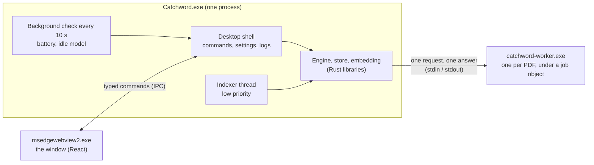
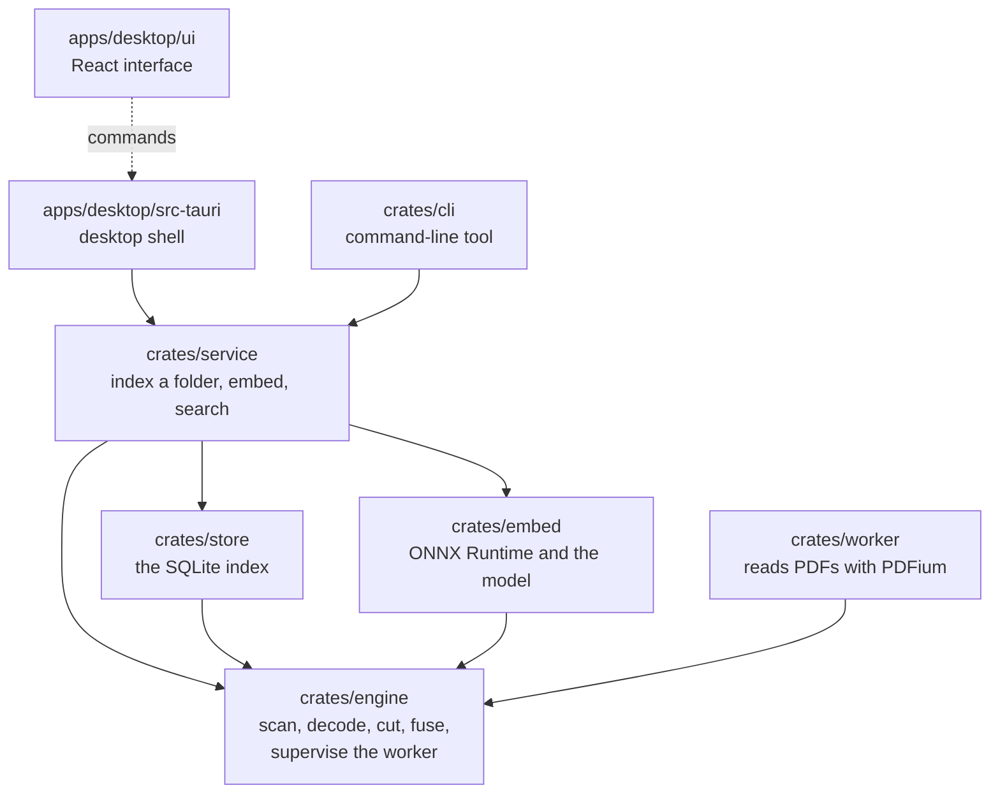
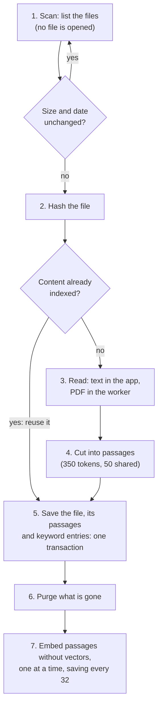
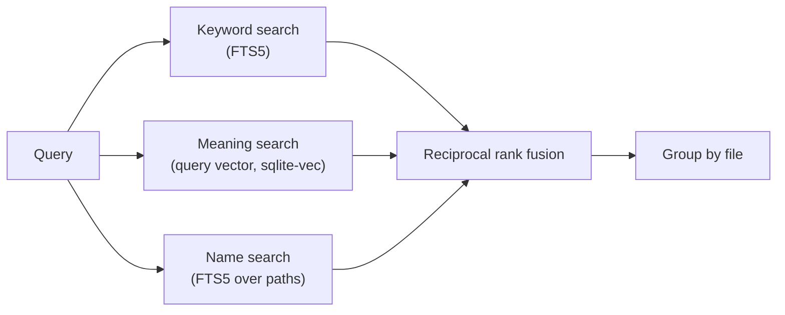

# How Catchword is built

A ten-minute tour for a new contributor. The details live in the [specification](../specification.md), the [decision records](../adr/) and the [threat model](../threat-model.md). This page shows how the parts fit together, as of 5 October 2026.

## In one paragraph

Catchword is a Windows desktop app. It reads the folders a user chooses, cuts the text of their documents into passages, and stores the passages in one SQLite file on the same computer. The file holds a keyword index and a vector for each passage, so that a search can match by words and by meaning. Nothing goes over the network. Untrusted files are read in a separate, limited process. Everything in the index can be rebuilt from the files.

## The three guarded areas

Three parts of the code decide how safe Catchword is. A change to any of them needs the maintainer's review and the checklist in the [threat model](../threat-model.md#review-checklist).

1. **The commands the interface can call** (`apps/desktop/src-tauri/src/commands.rs`, the allow-list in `build.rs` and `capabilities/main.json`, and the content security policy in `tauri.conf.json`). This is the only door between the web page, which shows untrusted document text, and the rest of the computer. Commands take ids from the index, never paths.
2. **The worker protocol** (`crates/engine/src/extract/`, ADR-15). This is how the program that parses untrusted PDFs talks back. Everything it sends is checked as if an attacker wrote it.
3. **The network module.** It does not exist yet. When the updater comes, network code may live only in the desktop shell, to a fixed list of hosts. Everything else is built without network libraries, and `scripts/check-no-network.sh` checks that on every change.

## Processes

- **No service, no port.** Indexing runs while the app runs. The window talks to the shell through Tauri's own channel, not through a network socket (ADR-2).
- **One worker process per PDF.** On Windows, a job object limits it to 512 MB and one process, and kills it when its time runs out (ADR-16). Plain text and Markdown are read inside the app, because they need decoding but no parsing (ADR-17).
- **Two connections to the index.** The indexer thread writes. Searches read through a second connection, so they never wait for writes (SQLite's WAL mode).

## The code

| Where | What it does | Start reading at |
| --- | --- | --- |
| `crates/engine` | Lists files without opening them (`scan`), leaves out what is excluded, decodes text, cuts passages to the model's size, fuses ranked lists, and runs and checks the worker | `lib.rs`, then `extract/mod.rs` |
| `crates/worker` | A small program that reads one PDF with PDFium and answers with its pages' text, or a reason | `main.rs` |
| `crates/store` | The index: files, contents (by hash), passages, keyword indexes for text and for file names, vectors, files not indexed and why | `lib.rs`: `put_file`, `search_with_names` |
| `crates/embed` | Turns text into vectors with ONNX Runtime and the Granite model, checked against pinned checksums | `lib.rs`: `Embedder::load` |
| `crates/service` | The use cases both front ends share: index a folder, embed what is missing, search | `index.rs`, `search.rs` |
| `apps/desktop/src-tauri` | The desktop shell: the commands, the indexer thread, settings, logs, diagnostics, battery and disk checks | `commands.rs` (`AppState`), `indexing.rs` |
| `apps/desktop/ui` | The interface: Search, Library, Settings, first launch. It never parses a document, and shows document text as plain text only | `App.tsx`, `Search.tsx`, `engine.ts` |
| `crates/cli` | `catchword index`, `search` and `status`, for development and for measuring | `main.rs` |
| `crates/eval` | The search-quality evaluation (2,544 judged queries) and its thresholds | `eval/README.md` |
| `crates/test-support` | What tests share: scratch folders, sample PDFs, a stand-in model, and the conformance suites | `conformance.rs` |

The types that cross between the shell and the interface live in `apps/desktop/src-tauri/src/contract.rs`. TypeScript copies are generated from them (`ui/src/contract/`), and a test fails if the two drift apart.

## Indexing

- **Two stages.** A file is searchable by its words as soon as step 5 commits. Meaning follows in step 7, which is the slow part: about 17 passages a second on the owner's laptop.
- **Nothing half-done.** Each file is one transaction. A stopped run, by pause, crash or power cut, carries on where it stopped (rule 3).
- **Files not indexed** are recorded with a reason, such as a scan with no text, a password or a timeout. They are listed in Library, and not read again until they change.
- **Deleting is thorough.** Purged text leaves nothing readable in the file (ADR-22).

The run lives in `crates/service/src/index.rs` (`index_folder`, `embed_missing`). The desktop's thread around it, with pause, battery, low disk and progress, is in `apps/desktop/src-tauri/src/indexing.rs`.

## Searching

- **Words first.** The interface first asks for words and names alone, which take tens of milliseconds and need no model. It shows them only if the full search has not arrived within 150 ms.
- **Quotes** ask for exact words. **Filters** keep to a folder, a kind of file or recent changes. Of identical copies, the one the filter allows is shown.
- **Search quality is measured** by `crates/eval` against fixed thresholds (ADR-19, ADR-20). A change to search must keep them.

The search is in `crates/service/src/search.rs` and `crates/store/src/lib.rs` (`combine`).

## Data: what is precious and what is not

| What | Where (Windows) | If it is lost |
| --- | --- | --- |
| The user's documents | Their own folders | Never touched: Catchword only reads them (rule 4) |
| Settings: folders, what to leave out, choices | `%LOCALAPPDATA%\org.catchword.desktop\config` | Precious: written so a crash cannot lose them, with the previous copy kept |
| The index | `...\data\index.db`, or a folder the user chose (ADR-23) | Derived: rebuilt from the files. A damaged one is rebuilt by itself at start |
| Logs and crash reports | `...\logs` | Small, rotated, and never holding document text or searches |
| The program, PDFium, ONNX Runtime and the model | `%LOCALAPPDATA%\Catchword` | Reinstall. The model is checked against its checksum every time it loads |

## The rules that shape everything

From `CLAUDE.md`, the project's working rules:

1. No network code outside the desktop shell.
2. Untrusted files are parsed only in the worker, with time and memory limits.
3. The index is derived data: one transaction per document, and everything can be rebuilt.
4. The user's documents are never modified, moved or deleted.
5. Document text is shown as plain text only.
6. Format, lint and tests pass before every commit.
7. Every new behaviour has a test.
8. New dependencies are asked for first; no GPL or AGPL libraries.

## How it is tested

- **Unit and integration tests** in every crate: `cargo test --workspace`. They include hostile input, such as damaged PDFs, a decompression bomb and malformed worker answers, and byte-level checks that purged text is gone.
- **Conformance suites** (ADR-21): every file reader and every embedding model must pass the same tests.
- **Interface tests** with a made-up engine: `npm test` in `apps/desktop/ui`.
- **The evaluation:** `cargo run -p catchword-eval -- check`.
- **Checks:** `cargo clippy`, `cargo fmt`, `sh scripts/check-no-network.sh` and `sh scripts/check-pinned-actions.sh`.

## Where next

- [CONTRIBUTING.md](../../CONTRIBUTING.md): setting up, and how changes are made.
- [The decision records](../adr/README.md): why things are as they are.
- [The threat model](../threat-model.md): what Catchword defends against, and how.
- [The specification](../specification.md): the full plan, in 26 sections.
- [HANDOVER.md](../../HANDOVER.md): the current state of the work.
