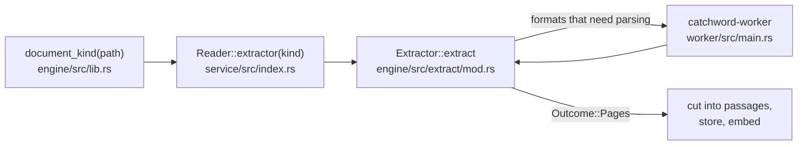

# Adding a file format

Teaching Catchword to read a new kind of file is the main way to contribute. This guide walks through it, step by step. Its example is Rich Text (`.rtf`), one of the formats the specification lists as welcome (EXT-8). The real, working example to compare with is PDF.

Read [How Catchword is built](../architecture/overview.md) first: it takes ten minutes.

## Before you write code

1. **Open an issue** saying which format you want to add and which library you would read it with. The formats wanted are listed in section 6 of the [specification](../specification.md): Office files (`.docx`, `.xlsx`, `.pptx`, planned for 0.2), and `.rtf`, `.html`, `.epub`, `.odt` and `.csv`.
2. **Choose the library with care.**
   - It must be in Rust or C. Its licence must be one listed in [`about.toml`](../../about.toml): no GPL and no AGPL.
   - The maintainer agrees to every new dependency before it is added (rule 8).
   - A parser reads files that may be written by an attacker, so prefer a library that is maintained, is fuzzed, and is in Rust.
3. **Decide where it is read.**
   - *Parsing* a format happens only in the worker, a separate program under time and memory limits (rule 2). That covers almost every format: RTF, HTML, Office files, EPUB.
   - Only a format that needs *decoding* alone, with no structure to parse, may be read inside the app, as plain text is ([ADR-17](../adr/0017-text-files-in-the-engine.md)). CSV is one: it is text with commas, and can join the text formats in step 1.

## How a file becomes searchable



1. The scan finds a file, and `document_kind` decides by its extension what kind of document it is. `None` means "not a format this version reads", and the file is ignored.
2. The service picks an *extractor* for that kind.
3. The extractor returns the text, as `Outcome::Pages`, or why there is none, as `Outcome::NotIndexed(reason)`. For PDF it sends the file to the worker and checks the answer.
4. The rest is the same for every format: cutting into passages, storing, embedding, searching.

## Step 1: recognise the extension

In `crates/engine/src/lib.rs`, add a kind and its extensions:

```rust
pub enum DocumentKind {
    /// Plain text and Markdown, read by the engine itself (ADR-17).
    Text,
    /// PDF, read only by the extraction worker.
    Pdf,
    /// Rich Text, read only by the extraction worker.
    Rtf,
}

pub fn document_kind(path: &Path) -> Option<DocumentKind> {
    // ...
    match extension.as_deref() {
        Some("txt" | "md" | "markdown") => Some(DocumentKind::Text),
        Some("pdf") => Some(DocumentKind::Pdf),
        Some("rtf") => Some(DocumentKind::Rtf),
        _ => None,
    }
}
```

Then run `cargo build --workspace`. The compiler lists every `match` that must now handle the new kind; the main one is in step 3.

## Step 2: read the format in the worker

The worker is `crates/worker/src/main.rs`. It reads one request (a file's path and two limits) from its standard input, extracts the text, writes one response, and exits. Read it whole: it is under 100 lines.

### Talk to the maintainer first: how the worker tells formats apart

Today the worker reads every file as a PDF, because PDF is the only format it knows. The first new format must give it a way to tell them apart. That changes a guarded area, so the maintainer chooses, in your issue, between:

- **the extension:** the worker calls the same `catchword_engine::document_kind(&request.path)` the engine used. The protocol does not change;
- **the kind in the request:** `protocol::Request` gets a field. That changes the worker protocol ([ADR-15](../adr/0015-worker-protocol.md)), so its version goes up, and the [guarded-area checklist](../threat-model.md#review-checklist) applies.

Either way, the worker ends up with one function per format.

### Write the reading function

Model it on the PDF code in `main.rs`. A reading function takes the request and returns a `Response`:

```rust
fn extract_rtf(request: &Request) -> Response {
    let bytes = match std::fs::read(&request.path) {
        Ok(bytes) => bytes,
        Err(_) => return Response::Refused(Refusal::CannotOpen),
    };
    // Parse with the library you agreed on in the issue.
    let text = match your_rtf_library::to_plain_text(&bytes) {
        Ok(text) => text,
        Err(_) => return Response::Refused(Refusal::Damaged),
    };
    if text.len() > request.max_text_bytes as usize {
        return Response::Refused(Refusal::TooLarge);
    }
    // RTF has no pages: the whole text is one page.
    Response::Pages(vec![text])
}
```

`your_rtf_library` stands for the library you chose. Whatever the format, the rules are the same:

- **Keep to the limits in the request.** Above `max_pages` pages, or `max_text_bytes` bytes of text, answer `Refusal::TooLarge`. Stop as soon as you know: do not read everything first.
- **Answer with a reason, never a panic, for a bad file.** Use `Damaged` for a file that cannot be parsed, `Encrypted` when it needs a password, and `CannotOpen` when it cannot be read at all. The engine survives a crash or a hang, but a reason tells the user why.
- **Pages if the format has them.** `Response::Pages` holds the text of each page in order, and page numbers are shown with results. A format without pages, such as RTF, answers with one entry; results then show line numbers.
- **Nothing else.** The worker writes no file, uses no network, and starts no other program. On Windows, its job object stops it from starting one anyway.
- **Do not clean the text.** The engine removes control characters and checks the answer's size and encoding (`crates/engine/src/extract/protocol.rs`). Return the text as the library gives it.

## Step 3: give the format an extractor

In `crates/engine/src/extract/mod.rs`, the `Extractor` trait has two methods:

```rust
pub trait Extractor {
    /// True if the text comes in pages, each with its number.
    fn paged(&self) -> bool;

    fn extract(
        &self,
        file: &Path,
        limits: &Limits,
        keep_going: &mut dyn FnMut() -> bool,
    ) -> io::Result<Outcome>;
}
```

A format read by the worker sends the file there with `run_while`, which applies every limit, stops the worker if the user pauses, and turns whatever the worker does into an `Outcome`. `PdfReader` is the whole pattern:

```rust
pub struct RtfReader {
    pub program: PathBuf,
}

impl Extractor for RtfReader {
    fn paged(&self) -> bool {
        false
    }

    fn extract(
        &self,
        file: &Path,
        limits: &Limits,
        keep_going: &mut dyn FnMut() -> bool,
    ) -> io::Result<Outcome> {
        run_while(&self.program, file, limits, keep_going)
    }
}
```

Then, in `crates/service/src/index.rs`, `Reader::extractor` picks it for your kind. Follow how it makes the `PdfReader`, from `self.worker.path()?`.

## Step 4: test it

Every behaviour has a test (rule 7). A format needs at least these.

1. **The conformance suite.** Every extractor must pass `catchword_test_support::conformance::extractor`. It checks that:
   - the text comes back without control characters, and the same each time;
   - a missing file gives `CannotOpen`, and a file over the size limit gives `TooLarge`;
   - a request to stop is obeyed.

   It needs a way to make a sample file holding a given text. Copy `crates/worker/tests/conformance.rs`:

   ```rust
   #[test]
   fn the_rtf_reader_meets_the_extractor_contract() {
       let reader = RtfReader {
           program: PathBuf::from(env!("CARGO_BIN_EXE_catchword-worker")),
       };
       conformance::extractor(&reader, "rtf", &|text| {
           format!(r"{{\rtf1\ansi {text}}}").into_bytes()
       });
   }
   ```

2. **Your format's own cases,** like `crates/worker/tests/pdf.rs`: several pages if it has them, a password, an empty file, and text in a language with non-Latin letters.
3. **Hostile files,** like `crates/worker/tests/hostile_pdfs.rs` and `bombs.rs`. Cut a good file short at many places, change bytes at random with a seeded generator, and build a file that expands enormously. Each must end as text or a reason within the time limit, and never as a failure of the engine.
4. **Sample files.** Make them in the test's code where you can, as `catchword_test_support::pdf` does. If you need a real file, say where it comes from and under which licence, in the same folder (TST-2).

Run `cargo test --workspace`. If your format changes what search finds, also run the evaluation: `cargo run -p catchword-eval -- check`.

## Step 5: the finishing touches

- **The interface's Kind filter:**
  - `FileKind` in `apps/desktop/src-tauri/src/contract.rs`, and its extensions in `search_filtered` in `commands.rs`;
  - its label in `apps/desktop/ui/src/strings.ts`, and the option in `Search.tsx`.

  Then regenerate the TypeScript types with `UPDATE_CONTRACT=1 cargo test -p catchword-desktop contract`.
- **Licence notices:** a new library must appear in the notices. Run `node scripts/notices.mjs`; it fails if the licence is not on the list in `about.toml`.
- **Documents:**
  - the README's "What works today";
  - "What Catchword can and cannot read yet" in the [user guide](../user/guide.md);
  - the CHANGELOG;
  - the T1 row of the [threat model](../threat-model.md), if a new parsing library joined the worker.

## Before you open the pull request

- [ ] The maintainer agreed to the library, and to how the worker tells formats apart.
- [ ] `cargo fmt --all`, `cargo clippy --workspace --all-targets -- -D warnings` and `cargo test --workspace` pass.
- [ ] `sh scripts/check-no-network.sh` passes.
- [ ] The conformance suite runs for the new extractor, and hostile files are tested.
- [ ] Sample files are made in code, or their source and licence are recorded.
- [ ] The guarded-area checklist is filled in, if the worker protocol changed.

## Later, richer formats

Office files will want to say where a passage is: a heading, a sheet or a slide (EXT-6). Today the worker's answer carries pages only, and a result shows a page or lines. Richer places need a new protocol version and changes to how passages are stored, which ADR-15 expects. Raise it in your issue before you start.
